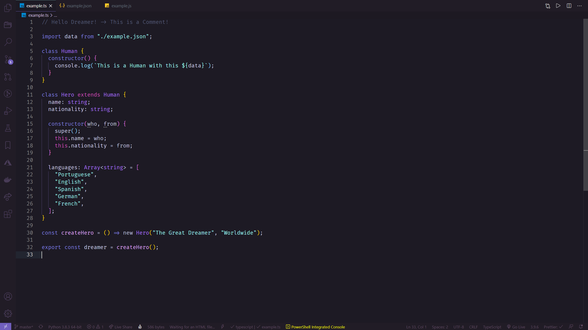
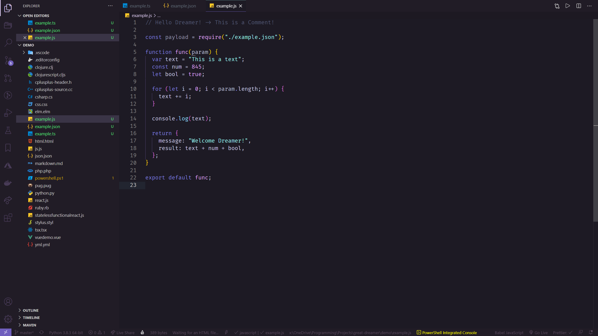

# The Great Dreamer :octopus:

A Visual Studio Code theme for the **Great Dreamers** all over the place, best suited for intensive use-cases specially during night. The color palette and overall theme is heavily inspired by Lovecraft Myths and overall feel.

Feel free to contribute and help to improve the language coverage of the Theme!

## The Great Dreamer Classic

# Installation

1.  Install [Visual Studio Code](https://code.visualstudio.com/)
2.  Launch Visual Studio Code
3.  Choose **Extensions** from menu
4.  Search for `great dreamer`
5.  Click **Install** to install it
6.  Click **Reload** to reload the Code
7.  From the menu bar click: Code > Preferences > Color Theme > **The Great Dreamer**
